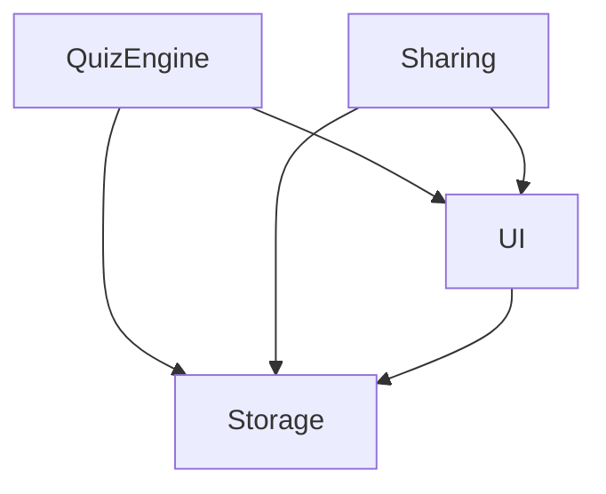

# Architecture Overview

## System Design

### Core Modules

```diagram
Riddler/
├── Core/
│   ├── QuizEngine.lua     # Core quiz functionality
│   ├── Storage.lua        # Data persistence
│   ├── UI.lua            # User interface
│   └── Sharing.lua       # P2P quiz sharing
├── Data/
│   ├── Questions/        # JSON quiz files
│   └── Templates/        # Default quiz templates
└── Localization/         # Language files
```

## Module Dependencies



## Communication Flow

### Quiz Flow

1. Host starts quiz
2. QuizEngine loads questions from Storage
3. UI displays current question
4. Players submit answers via chat
5. QuizEngine processes responses
6. UI updates scoreboard
7. Cycle repeats until quiz ends

### Sharing Flow

1. Host initiates share
2. Sharing module creates private channel
3. Receiver accepts transfer
4. Data chunks transmitted
5. Storage saves received quiz
6. Channel closed

## State Management

### Quiz States

```lua
local QuizState = {
    INACTIVE = 0,
    STARTING = 1,
    QUESTION_ACTIVE = 2,
    BETWEEN_QUESTIONS = 3,
    ENDING = 4
}
```

### Save States

- Periodic state saves
- Crash recovery data
- Player progress tracking
- Statistics accumulation

## Error Handling

### Recovery Scenarios

1. Player disconnect
2. Host disconnect
3. Channel issues
4. Data corruption
5. UI errors

### Error Prevention

- Input validation
- State verification
- Data integrity checks
- Graceful degradation

## Performance Considerations

### Memory Management

- Question pooling
- UI component recycling
- Efficient string handling
- Minimal state updates

### Network Optimization

- Chunked data transfer
- Compressed messages
- Rate limiting
- Channel management

## Security

### Data Validation

- Input sanitization
- JSON schema validation
- Channel access control
- Version checking

### Anti-Abuse Measures

- Rate limiting
- Answer validation
- Channel monitoring
- Transfer size limits
